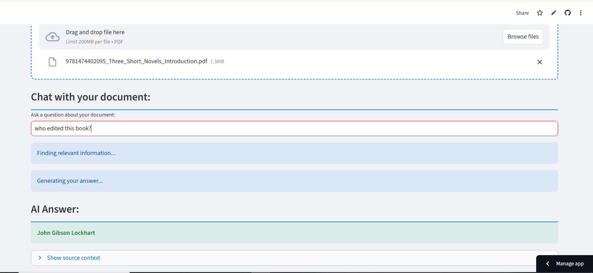

# 🤖 AI Document Chatbot (RAG)

**➡️ Live Demo:** [**Click here to try the app!**](YOUR_APP_URL_HERE)

A web application built with Streamlit that allows users to chat with their PDF documents. This project implements a complete **Retrieval-Augmented Generation (RAG)** pipeline from scratch.

  
*(To add this, take a screenshot of your app, name it `demo.png`, and add it to this folder.)*

---

## ✨ Features

* **PDF Text Extraction:** Upload any PDF and the app automatically extracts 100% of the text using `PyMuPDF`.
* **Retrieval-Augmented Generation (RAG):**
    * **Retrieval:** Uses `sentence-transformers` to embed document chunks into a vector database (`FAISS`). When you ask a question, it finds the most relevant pieces of information.
    * **Generation:** Uses a `transformers` QA pipeline (`distilbert-squad`) to read the relevant context and *generate* a precise answer.
* **Interactive Chat:** A clean, CSS-styled interface to ask questions and receive answers.
* **Cached Models:** AI models are cached using `st.cache_resource` for fast load times after the initial startup.

---

## 🛠️ Tech Stack

* **Framework:** [Streamlit](https://streamlit.io/)
* **AI Models:** [Hugging Face Transformers](https://huggingface.co/)
    * `all-MiniLM-L6-v2` (for Retrieval/Embedding)
    * `distilbert-base-cased-distilled-squad` (for Generation/QA)
* **Vector Database:** [FAISS (Facebook AI Similarity Search)](https://faiss.ai/)
* **PDF Processing:** [PyMuPDF](https://pymupdf.github.io/)

---

## 🚀 How to Run Locally

1.  **Clone the repository:**
    ```bash
    git clone [https://github.com/Squaddyy/AI-Doc-Chatbot.git](https://github.com/Squaddyy/AI-Doc-Chatbot.git)
    cd AI-Doc-Chatbot
    ```

2.  **Create and activate a virtual environment:**
    ```bash
    # For Windows
    py -m venv venv
    source venv/Scripts/activate
    
    # For macOS/Linux
    python3 -m venv venv
    source venv/bin/activate
    ```

3.  **Install the required packages:**
    ```bash
    pip install -r requirements.txt
    ```

4.  **Run the Streamlit app:**
    ```bash
    streamlit run app.py
    ```

---